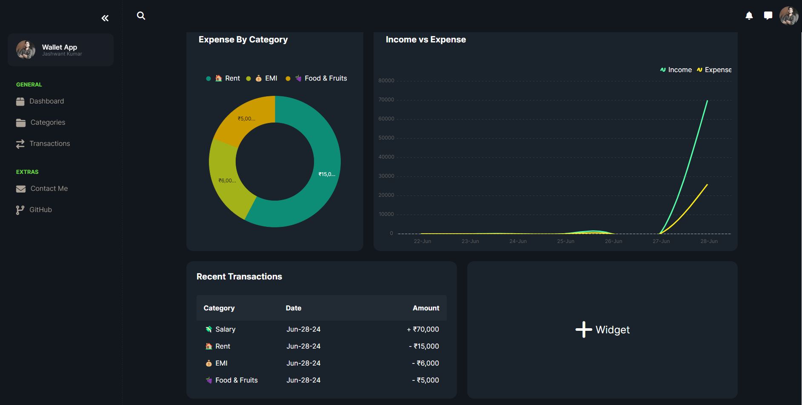
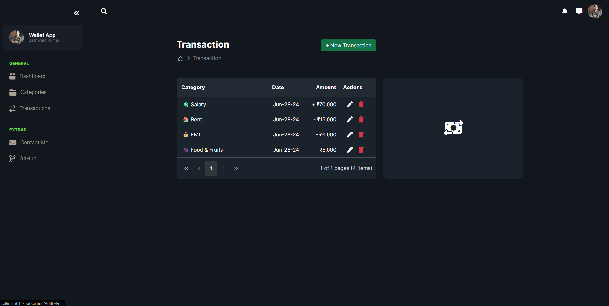

# SpendWise

SpendWise is an Expense Tracker App built with Asp.Net Core MVC using SyncFusion Components.

This repository contains a complete Asp.Net Core application demonstrating the development of an enterprise expense tracking system.

**Features:**
- Implemented CRUD Operations for Categories and Transactions
- Enhanced Transaction Grid with Paging and Sorting
- Interactive Dashboard with Chart Elements
- Side Menu integrated within a Dockable Side Bar
- Etc.
## More info

- **CRUD Operations**: Manage expense categories and transactions with Create, Read, Update, and Delete operations.
- **Transaction Grid**: Utilize SyncFusion components for a responsive grid with advanced paging and sorting capabilities.
- **Dashboard**: Visualize expense trends and summaries using interactive chart elements.
- **User Interface**: Intuitive side menu navigation integrated within a dockable side bar for improved user experience.

## Demo

Here are some screenshots from the SpendWise application:

*Dashboard displaying expense trends and summaries for SpendWise.*

*Transaction grid with paging and sorting functionality for SpendWise.*

*CRUD operations for managing expense categories in SpendWise.*

